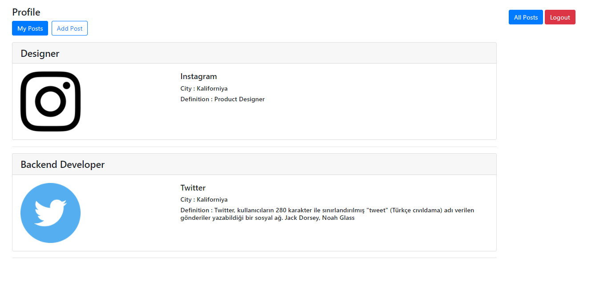
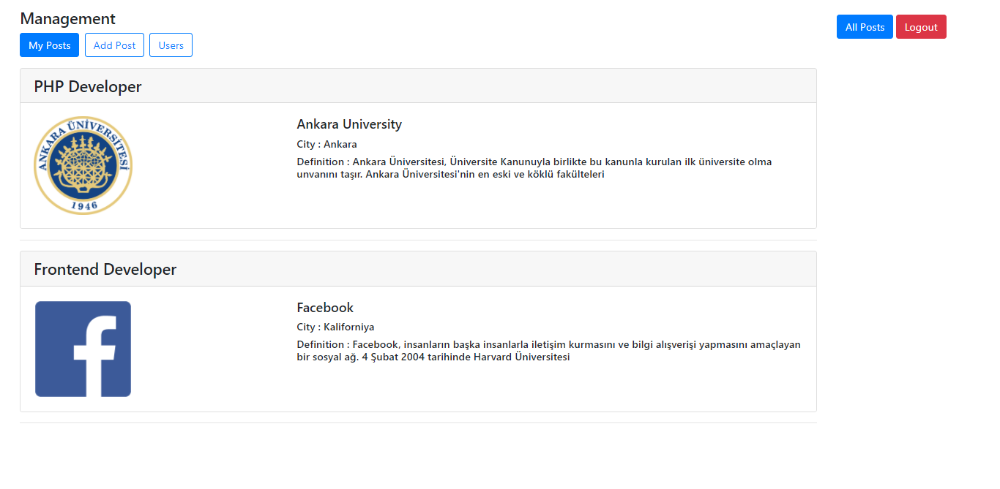

# Job Finder

A simple web app which implements auto suggestion, posting and listing with PHP.

## ⚙ Installation

Two steps needed to make it work:
* An Apache server to serve app
* A relational DBMS like MySQL to import sample SQL file

## :camera: Screenshots

</img>
</img>
</img>
</img>
</img>
</img>
</img>
